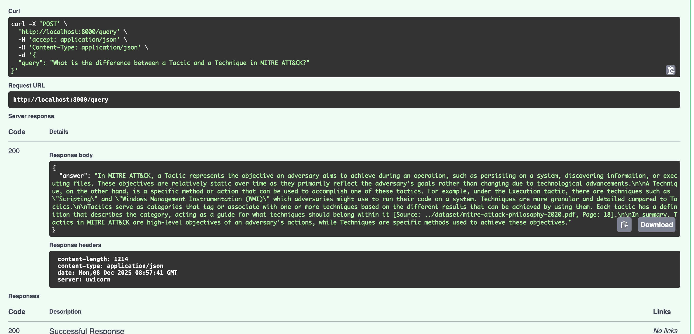

# Cybersecurity RAG Assistant

## Overview
A RAG system that answers cybersecurity questions using OWASP, MITRE ATT&CK, 
and Thailand Web Security Standard documents.

## Installation
pip install -r requirements.txt

## Prerequisites
- Ollama installed and running: https://ollama.ai
- qwen2.5 model: `ollama pull qwen2.5`

## Usage

### Step 1: Ingest Documents
python src/ingestion.py

### Step 2: Start the API
python main.py
# or: python -m uvicorn main:app --reload

### Step 3: Query the System
curl -X POST http://localhost:8000/query \
  -H "Content-Type: application/json" \
  -d '{"query": "What is Broken Access Control?"}'

 **Note:** Can also test the API interactively at http://localhost:8000/docs

## Architecture
See [docs/architecture.md](docs/architecture.md) for details.

## Evaluation
See [docs/evaluation_examples.md](docs/evaluation_examples.md) for details.

### Example

