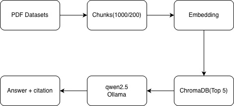

## Model Selection: Qwen 2.5 

Qwen 2.5 is selected for this RAG system due to:

Efficiency: It runs effectively on local hardware without requiring high-end GPUs.

Instruction Following: It outperforms models like Llama 2 and Mistral in adhering to strict "context-only" prompting.

Simplicity: The base model works well out-of-the-box. Avoided fine-tuning to reduce complexity, development time risks.

Integration: It offers seamless local inference via Ollama.

## System Diagram

## Pipeline Overview

1. **Ingestion**: PDFs loaded via PyPDFLoader, split into 1000-char chunks with 200-char overlap
2. **Embedding**: sentence-transformers/all-MiniLM-L6-v2 (lightweight, runs locally)
3. **Storage**: ChromaDB (persistent vector database)
4. **Retrieval**: Top-5 similarity search
5. **Generation**: Qwen 2.5 via Ollama with strict context-only prompting
6. **Two API Endpoints for Query**: A standard endpoint that returns the full response, and a streaming endpoint that returns the response in real-time chunks. You can test the streaming endpoint using:
curl -N -X POST http://localhost:8000/query/stream \
  -H "Content-Type: application/json" \
  -d '{"query": "What is SQL injection?"}'
  
7. **Log Latency**: Middleware that tracks and logs the response time for each API request.